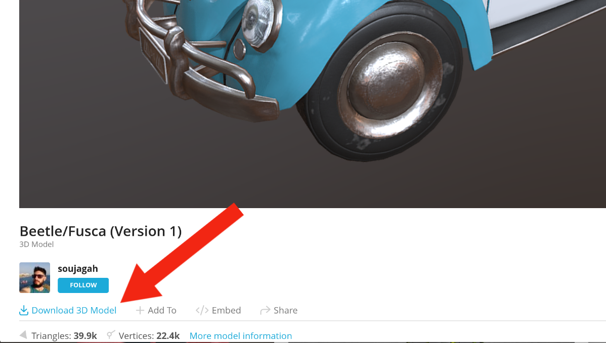
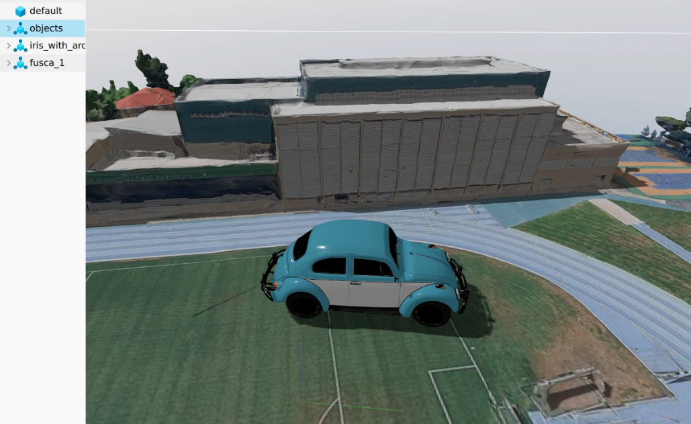

# Escolhendo o modelo
> [!NOTE]
>Caso já tenha o arquivo correspondente ao modelo baixado e pronto para ser adicionado, esse tópico é dispensável.

- Primeiramente, é necessário encontrar o modelo que será adicionado ao mundo. Para isso, existem diversos sites de repositórios de modelos 3D. Um dos mais populares é o [*Sketchfab*](https://sketchfab.com/feed).
- Antes de acessar os modelos 3D, é preciso logar na plataforma para ter permissão de baixá-los usando a opção de "**LOGIN**". Caso não tenha uma conta, ela pode ser rapidamente criada a partir da opção de "**SIGN UP**". 


<div align="center">
  
</div>

- Após o login efetuado com sucesso, será aberto o feed do *Sketchfab* onde será possível pesquisar pelo modelo desejado na barra de busca no canto superior da tela.

<div align="center">
  
</div>

- Após selecionar o modelo desejado, será aberta a página correspondente a ele. Para baixá-lo, é preciso certificar-se que o modelo está disponível para *download*, como mostra a opção abaixo.

<div align="center">
  
</div>

> [!NOTE]
Caso essa opção não apareça, então o dono do modelo não autoriza o seu *download*. Portanto, é recomendado procurar outro modelo semelhante.

- Ao clicar na opção de "**Download 3D Model**", será aberta uma janela com vários formatos de modelo 3D que podem ser baixados.

<div align="center">
  
</div>

- É recomendado baixar apenas modelos **.fbx** ou **.glb**, pois eles foram os mais testados e possuem garantia de funcionamento. Entretando, o Gazebo também suporta modelos **.dae**, **.stl** e **.obj**.
- Ao clicar em "**DOWNLOAD**", o modelo no formato escolhido será baixado e estará pronto para ser adicionado ao mundo da simulação.

# Adicionando o modelo ao mundo

## Adicionando o modelo ao repositório
- Com o arquivo do modelo pronto, será necessário criar uma pasta para ele em `simulation/simulation_resources/simulation_worlds/`. Logo, partindo da raíz do repositório:
```bash
mkdir simulation/simulation_resources/simulation_worlds/<nome-do-modelo>
```
- Dentro da pasta criada, é preciso criar dois arquivos `model.sdf` e `model.config`.
    - O formato deles é padronizado entre os modelos usados na simulação, sendo necessário apenas modificar as informações específicas do modelo que está sedo adicionado.
    - Template do `model.config`
    ```xml
    <?xml version="1.0"?>
    <model>
        <name>NOME DO MODELO</name>
        <version>1.0</version>
        <sdf version='1.10'>model.sdf</sdf>

        <author>
            <name>NOME DO AUTOR</name>
            <email>EMAIL DO AUTOR</email>
        </author>

        <description>
            DESCRICAO DO MODELO
        </description>
    </model>
    ```
    > [!NOTE]
    Os campos dentro da tag `<author>` não são obrigatórios, podendo ficar vazios, apesar de ser boa prática preenchê-los.

    - Template do `model.sdf`
    ```xml
    <?xml version="1.0"?>
        <sdf version='1.10'>
        <model name='NOME_DO_MODELO'>
        <pose>0 0 0 0 0 0</pose>
            <link name='base_link'>
            <pose>0 0 0 0 0 0</pose>
            <inertial>
                <pose>0 0 0 0 0 0</pose>
                <mass>100</mass>
                <inertia>
                <ixx>1</ixx>
                <iyy>1</iyy>
                <izz>1</izz>
                </inertia>
            </inertial>
            <collision name='base_link_collision'>
                <pose degrees="true">0 0 0 0 0 0</pose>
                <geometry>
                <box>
                    <size>1.0 1.0 1.0</size>
                </box>
                </geometry>
            </collision>
            <visual name='base_link_visual'>
                <pose degrees="true">0 0 0 0 0 0</pose>
                <geometry>
                <mesh>
                    <scale>1.0 1.0 1.0</scale>
                    <uri>model://PASTA-DO-MODELO/meshes/ARQUIVO-DO-MODELO</uri>
                </mesh>
                </geometry>
            </visual>
            </link>
        </model>
    </sdf>
    ```
    > [!NOTE]
    É recomendado que a pasta do modelo e o arquivo do modelo baixado tenham o mesmo nome para evitar confusões.
- Após isso, é preciso criar uma pasta chamada `meshes` dentro da mesma pasta do modelo que foi criada e onde foram adicionados os arquivos anteriormente.
```bash
mkdir simulation/simulation_resources/simulation_worlds/<nome-do-modelo>/meshes
```
- Após a criação da pasta, adicione nela o arquivo **.glb** ou **.fbx** baixado anteriormente.

## Editando arquivo de configurações
>[!NOTE]
> Para que um modelo seja carregado no mundo quando a simulação for executada, é preciso adicioná-lo no arquivo de configuração `simulation/simulation_resources/patches/custom_objects_config.json` e indicar qual será a sua posição.

- No arquivo `simulation/simulation_resources/patches/custom_objects_config.json`, dentro da lista de `objects`, adicione um objeto seguindo o template abaixo:

```json
    {
      "id": <id-unico>,
      "x": <posicao-em-x>,
      "y": <posicao-em-y>,
      "z": <posicao-em-z>,
      "model": "<nome-do-modelo>"
    }
```

>[!NOTE]
> Caso queira adicionar mais de um objeto do mesmo modelo, é só adicionar mais elementos na lista de `objects`.

# Executando a simulação com o novo modelo

- Para executar a simulação, é necessário ativar a flag de objetos customizados da seguinte forma:

```bash
cd scripts
CUSTOM_OBJECTS=true ./sim_run.sh
```

- Com isso, a infraestrutura de simulação deve ser iniciada e você deverá ver o seu novo modelo no mundo do Gazebo.

<div align="center">
  
</div>

# Possíveis problemas

### O modelo aparece muito pequeno (ou muito grande) no mundo
Esse problema normalmente está relacionado com a tag de `<scale>` no arquivo `model.sdf` dentro da pasta do modelo.
- Para aumentar o seu tamanho, é preciso preencher a tag com valores maiores que 1.0.
- Para diminuir o seu tamanho, é preciso preencher a tag com valores menores que 1.0.
- Exemplo:
```xml
<!-- Aumenta cada medida do modelo em 3x -->
<scale>3.0 3.0 3.0</scale>
```
>[!WARNING]
É importante ter cuidado para não se confundir e acabar modificando a tag `<size>`, ela não possui relação com o modelo 3D, apenas com a caixa de colisão do objeto. 

### O caixa de colisão do objeto aparece muito pequena (ou muito grande) no mundo
A solução é muito semelhante com a do problema anterior, só que deverá ser modificada a tag `<size>`, de forma que cada um dos valores correspondem ao tamanho dos lados caixa em metros.
- Exemplo:
```xml
<!-- Define uma caixa de colisão 1.5 x 2.0 x 5.0 -->
<size>1.5 2.0 5.0</size>
```

### A caixa de colisão do objeto não está alinhada com o modelo
Normalmete isso acaba ocorrendo, já que os modelos 3D não possuem uma padronização da origem da caixa de colisão, então é preciso aplicar offsets nela para alinhá-los. Para isso, é preciso modificar a tag `<pose>` da caixa de colisão ou do modelo 3D.
- Exemplo
```xml
<!-- pose = x y z roll pitch yaw -->
<pose degrees="true">0 -0.9 -0.2 0 180 0</pose>
```